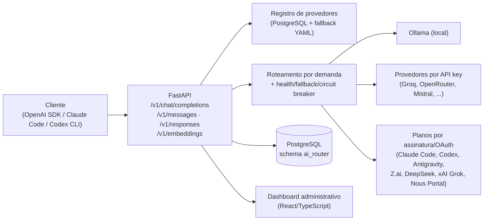

<p align="center">
  
</p>

<p align="center">
  Gateway de LLM self-hosted que roteia chat completions e embeddings entre múltiplos provedores com seleção baseada em saúde, fallback automático e roteamento por demanda — com API compatível com OpenAI, um tradutor para a Anthropic Messages API e um tradutor para a OpenAI Responses API, todos compartilhando o mesmo pipeline de roteamento e com streaming incremental de ponta a ponta.
</p>

<p align="center">
  
  
  
</p>

---

## Visão Geral

O ForgeRouter fica na frente de um pool de provedores de LLM — modelos locais via Ollama, provedores por chave de API (Groq, OpenRouter, Mistral e outros configuráveis) e planos de assinatura via OAuth (Claude Code, Codex, Antigravity, Z.ai, DeepSeek, xAI Grok, Nous Portal) — e os expõe como um único gateway. Basta apontar qualquer cliente compatível com OpenAI, o Claude Code ou a Codex CLI para ele: o serviço cuida da seleção de provedor, verificação de saúde e failover, de modo que a queda de um provedor ou o rate limit de um plano gratuito nunca derrubem uma requisição.

Foi construído para o ecossistema Hermes (documentação canônica em `CLAUDE.md`), mas não possui nenhuma dependência de vendor específico — funciona como gateway de LLM genérico em qualquer instalação (ver [`INSTALL.md`](INSTALL.md) para o modo standalone).

O serviço fala três protocolos de cliente contra o mesmo pipeline de roteamento/fallback, além de um endpoint dedicado de embeddings:

- **`/v1/chat/completions`** e **`/v1/models`** — compatível com OpenAI, incluindo streaming (SSE).
- **`/v1/messages`** — Anthropic Messages API, usada pelo Claude Code. O streaming é real e incremental, traduzido pedaço a pedaço a partir da resposta do provedor conforme ela chega — não é uma resposta completa reproduzida depois como um burst sintético de SSE.
- **`/v1/responses`** — OpenAI Responses API, usada pela Codex CLI (obrigatória desde que o Codex removeu o suporte a Chat Completions na v0.138). Mesmo streaming real e incremental de `/v1/messages`.
- **`/v1/embeddings`** — compatível com OpenAI, passando pela mesma seleção de candidatos e fallback baseados em saúde usados no chat.

O serviço inclui um dashboard administrativo embutido para gerenciar provedores, agentes, roteamento e uso — sem necessidade de um serviço separado.

## Principais Funcionalidades

- **Três protocolos de cliente, um único roteador** — OpenAI Chat Completions, Anthropic Messages e OpenAI Responses são todos traduzidos para a mesma requisição interna e compartilham a mesma seleção de candidatos, fallback e lógica de saúde. Os três fazem streaming incremental a partir da resposta real do provedor.
- **Roteamento multi-provedor** — mistura provedores locais (Ollama) e remotos (por chave de API ou por assinatura/OAuth) em um único pool, organizado por tiers de prioridade.
- **Seleção baseada em saúde com fallback automático** — os candidatos são tentados em ordem; um provedor com falha, rate-limited ou não saudável é pulado em favor do próximo saudável. Um `model` específico na requisição é uma *preferência*, não um filtro exclusivo — o restante do pool saudável permanece disponível como fallback.
- **Roteamento por demanda** — modelos virtuais (`forgerouter/auto`, `simple`, `standard`, `complex`, `reasoning`, `vision`, `audio`, `code`) classificam cada requisição a partir do seu conteúdo (partes de imagem ou áudio, marcadores/fences de código, linguagem de raciocínio, tamanho do prompt) e a roteiam por uma cadeia ordenada de modelos concretos.
- **Inteligência de roteamento em memória** — circuit breaker por provedor (falhas consecutivas o abrem temporariamente), sticky routing (o último modelo bem-sucedido de um agente para uma demanda permanece "grudado" por um curto período, preservando caches de prompt do provedor) e uma pontuação dinâmica que combina força estática do modelo com taxa de sucesso/latência recentes.
- **Scanner de saúde dos provedores com watchdog em segundo plano** — envia periodicamente chat completions reais a cada modelo configurado e detecta também falhas *silenciosas* (HTTP 200 com conteúdo vazio, texto de erro de cota/cobrança/autenticação no corpo), não apenas erros de conexão. Um scan completo roda assim que o serviço sobe, e uma checagem em segundo plano a cada 60s dispara um rescan automático (limitado a uma vez a cada 5 minutos) sempre que o pool saudável cai abaixo de um mínimo.
- **Compactação de contexto (sem perdas)** — remove formatação/espaços em branco incidentais das mensagens antes de enviá-las ao provedor; nenhum conteúdo semântico é removido. As contagens de tokens antes/depois são registradas por requisição.
- **Truncamento de contexto (com perdas, opt-in)** — válvula de segurança para históricos de conversa que crescem sem controle: quando os tokens estimados de uma requisição ultrapassam um percentual configurável da *janela de contexto real do modelo selecionado*, os turnos mais antigos são resumidos por um modelo barato (preservando nomes, decisões, números) e substituídos por uma nota condensada, em vez de estourar o limite real do modelo. Desativado por padrão; em caso de falha no resumo, cai para um descarte mecânico simples.
- **Chaves de API e controles por agente** — emite uma chave de API distinta por cliente/agente conectado, restringe-a a um subconjunto de modelos ou grupos de capacidade, define um orçamento mensal de custo de referência e classifica o agente como conversacional ou como consumidor de serviço interno.
- **Estimativa de custo de referência** — como o ForgeRouter é construído em torno de roteamento por camada gratuita, o custo real cobrado é quase sempre zero; ele estima o que a requisição *teria custado* às taxas comerciais públicas de um modelo equivalente, puramente como uma métrica de custo de oportunidade.
- **Auditoria sem armazenar conversas** — o ForgeRouter não persiste o corpo das mensagens por design. A única exceção limitada é um preview de ~100 caracteres da última mensagem do usuário por requisição, mantido para auditar no que um agente está gastando sua cota.
- **Dashboard administrativo** — interface React/TypeScript para gerenciar provedores, agentes, cadeias de roteamento/demanda, pricing e uso, servida diretamente pela API.
- **Persistência em banco com fallback para YAML** — o registro de provedores vive no PostgreSQL; um YAML embutido (`config/providers.yaml`) é usado automaticamente se o banco estiver inacessível ou vazio, para que o roteamento nunca pare por causa dele.

## Arquitetura

```text
Cliente (OpenAI SDK, Claude Code, Codex CLI, curl, ...)
        │
        ▼
 POST /v1/chat/completions  ·  /v1/messages  ·  /v1/responses  ·  /v1/embeddings
        │                       (traduzido para uma requisição
        │                        de Chat Completions e de volta)
        ▼
 Carrega o registro de provedores (PostgreSQL, com fallback para YAML)
        │
        ▼
 Classifica a demanda (auto/simple/standard/complex/reasoning/vision/audio/code)
        │
        ▼
 Infere a capacidade → filtra candidatos saudáveis/habilitados → ordena por
 cadeia de demanda, tier e pontuação dinâmica
        │
        ▼
 Compactação de contexto (sem perdas) → truncamento (opt-in, com perdas) →
 tenta os candidatos em ordem
        │
        ├─ sucesso ───────────► resposta enviada/streamada ao cliente
        │
        └─ falha ── registra route event, marca não saudável ── tenta o próximo
                                                                       │
                                                        todos falharam ┴─► 502 all_providers_failed
```



Cada provedor tem um `api_format` (`openai` ou `anthropic`) descrevendo seu protocolo de conexão; provedores por assinatura (Claude Code, Codex, Antigravity, Z.ai, DeepSeek, xAI Grok) passam por handlers de plano dedicados (`app/providers/plans.py`) que gerenciam tokens OAuth em vez de chaves de API estáticas — o Z.ai é o único que também aceita uma chave de API paga (`api.z.ai/api/coding/paas/v4`) como caminho alternativo ao OAuth. O Nous Portal é a exceção sem handler dedicado: não existe um servidor de autorização OAuth público para apps de terceiros se registrarem, então a autenticação é totalmente delegada a um processo externo ao Docker — `hermes proxy` (CLI do Hermes Agent) rodando no host como um credential-broker local — e o `base_url` do provider aponta para esse proxy como um endpoint OpenAI-compatível comum (ver `docs/SUBSCRIPTION_NOUS_PORTAL_REFERENCE.md`).

## Tecnologias

| Camada | Tecnologia |
|---|---|
| Backend | Python 3.11+, FastAPI, Uvicorn |
| Persistência | PostgreSQL (schema `ai_router`, acesso via `psycopg`) |
| Frontend / Dashboard | React, TypeScript, Vite |
| Contagem de tokens | `tiktoken` (`cl100k_base`) |
| Testes | `pytest` (40 arquivos de teste, sem banco/provedores reais) |
| Containerização | Docker, Docker Compose |
| Runtime WASM | `wasmtime` (isolamento de execução) |

## Estrutura do Projeto

```text
forgerouter/
├── app/
│   ├── main.py               # FastAPI app: rotas /v1/*, /auth/*, /admin/*
│   ├── registry.py           # Registro de provedores (DB + fallback YAML)
│   ├── demand.py             # Classificação de demanda (auto/code/vision/...)
│   ├── ranking.py            # Ordenação de candidatos (tier, dynamic score)
│   ├── routing_state.py      # Circuit breaker, sticky routing, cache de performance
│   ├── normalize.py          # Compactação e truncamento de contexto
│   ├── pricing.py            # Estimativa de custo de referência
│   ├── health_watchdog.py    # Rescans automáticos em segundo plano
│   ├── storage.py            # Todo o acesso a PostgreSQL (SQL cru via psycopg)
│   ├── deploy_config.py      # Escrita de config/chave em agentes externos
│   ├── providers/            # Clientes por provedor/plano (openai, anthropic,
│   │                         # claude_code, codex, antigravity, zai,
│   │                         # deepseek_web, xai_grok)
│   └── validation/           # Scanner e classificação de saúde
├── config/
│   ├── providers.yaml            # Registro de fallback (usado sem DB)
│   ├── model_pricing*.json       # Catálogos de pricing (vendorizado/live/overrides)
├── db/                        # Migrations SQL numeradas (aplicadas manualmente)
├── docs/                      # PRD, spec, referências de assinatura por provedor
├── frontend/                  # Dashboard React/TypeScript (build em frontend/dist)
├── scripts/                   # build, sync de pricing, health scan, OAuth login etc.
├── tests/                     # Suíte pytest (FastAPI TestClient, tudo mockado)
├── docker-compose.yml             # Deploy no ecossistema Hermes/Foundation
├── docker-compose.local.yml       # Igual ao acima, com host networking (Ollama local)
├── docker-compose.standalone.yml  # Deploy autônomo, com PostgreSQL embutido
├── Dockerfile
├── INSTALL.md                 # Guia de instalação standalone, passo a passo
└── CLAUDE.md                  # Guia de arquitetura para agentes/desenvolvedores
```

## Pré-requisitos

- Docker e Docker Compose
- Opcional: [Ollama](https://ollama.com) rodando localmente, para fallback com modelo local
- Todo o restante (Python 3.11+, dependências, Node/Vite) já está encapsulado na imagem Docker — não é necessário runtime Python/Node no host para rodar o serviço

## Instalação

**Rodando o ForgeRouter isoladamente?** Use o instalador standalone — ele empacota seu próprio container PostgreSQL, então não há nada a provisionar antes:

```bash
git clone https://github.com/marcelodarckferreira/ForgeRouter.git
cd ForgeRouter
./scripts/install_standalone.sh
```

O script cria o `.env` a partir de `.env.example` (se ausente), gera senhas de banco aleatórias, sobe o PostgreSQL, aplica o schema, builda a imagem e inicia o ForgeRouter. É seguro executar novamente — todos os passos são idempotentes. Veja [`INSTALL.md`](INSTALL.md) para o passo a passo manual equivalente, o que o script deliberadamente não faz, e notas de backup.

Verifique se está no ar:

```bash
curl http://127.0.0.1:2100/health
# {"status":"ok","version":"0.1.0","git_sha":"<commit>"}
```

O dashboard fica em `http://127.0.0.1:2100/` — o login padrão é `admin` / `admin`, com troca de senha obrigatória no primeiro acesso.

> **Fazendo deploy junto de um PostgreSQL já existente e de uma rede Docker externa** (por exemplo, como parte de um setup multi-serviço maior)? Use `docker-compose.yml` diretamente: aponte `DATABASE_URL` para o seu banco, aplique `db/*.sql` manualmente e em ordem contra ele, entre na sua própria rede Docker externa no lugar de `foundation_network`, e rode `./scripts/build.sh && docker compose up -d`. O `docker-compose.local.yml` é a mesma ideia com host networking, para alcançar um Ollama local em `127.0.0.1:11434`:
> ```bash
> docker compose -f docker-compose.local.yml up -d --build
> ```

## Configuração

O comportamento do próprio ForgeRouter é ajustado por um conjunto pequeno de variáveis de ambiente; o registro de provedores/modelos/agentes vive no PostgreSQL e é gerenciado em tempo de execução pelo dashboard ou pelos endpoints `/admin/*` — o `.env` só precisa de credenciais, não do registro em si.

```bash
cp .env.example .env
```

| Variável | Obrigatória | Descrição |
|---|---:|---|
| `DATABASE_URL` | Sim | String de conexão com o PostgreSQL |
| `DATABASE_CONNECT_TIMEOUT` | Não | Timeout de conexão em segundos (padrão `5`) |
| `POSTGRES_HOST` / `POSTGRES_PORT` / `POSTGRES_DB` / `POSTGRES_USER` / `POSTGRES_PASSWORD` | Apenas no modo standalone | Credenciais do container Postgres embutido (`docker-compose.standalone.yml`) |
| `PROXYROUTER_PASSWORD` | Apenas no modo standalone | Senha da role restrita `proxyrouter_user`, com a qual o serviço realmente se conecta ao banco |
| `<PROVIDER>_API_KEY` (ex.: `GROQ_API_KEY`, `OPENROUTER_API_KEY`, `MISTRAL_API_KEY`, `GEMINI_API_KEY`) | Não | Chaves de API por provedor — apenas para os provedores habilitados, correspondendo ao `api_key_env` de cada um em `config/providers.yaml` |
| `FORGEHUB_SSO_SECRET` | Não | Segredo compartilhado opcional para SSO confiável a partir de uma aplicação parceira (server-to-server) |
| `AUTO_INCLUDE_MIN_HEALTHY` | Não | Mínimo de candidatos saudáveis antes que modelos degradados por falha em runtime (ex.: rate-limited) reentrem no roteamento como reserva de último caso (padrão `3`) |
| `BREAKER_THRESHOLD` | Não | Falhas consecutivas de um provedor antes do circuit breaker em memória abrir (padrão `4`) |
| `BREAKER_COOLDOWN_SECONDS` | Não | Tempo que um breaker aberto permanece assim antes de uma sondagem half-open (padrão `120`) |
| `STICKY_TTL_SECONDS` | Não | Tempo que o último modelo bem-sucedido de um agente para uma demanda permanece "grudado" (padrão `600`) |
| `ENABLE_PAID_FALLBACK` / `REDACT_SECRETS` / `LOG_PROMPTS` | Não | Flags de segurança/log em `.env.example` |

Tudo o mais — quais provedores estão habilitados, quais modelos eles expõem, cadeias de roteamento por demanda, compactação/truncamento de contexto, chaves e orçamentos de agentes, sincronização de pricing — é configurado ao vivo pelo dashboard e persistido no PostgreSQL, sem precisar de variável de ambiente ou redeploy.

Autenticação com os provedores de assinatura (Claude Code, Codex, Antigravity, Z.ai, DeepSeek, xAI Grok) não usa `.env`: cada handler lê o token OAuth já mantido por sua respectiva CLI (`~/.codex`, `~/.gemini`, `~/.claude/.credentials.json`, `~/.zai`, `~/.deepseek`), exceto o xAI Grok, cujo login (`scripts/xai_oauth_login.py`) e refresh de token são realizados pelo próprio ForgeRouter (`~/.xai/auth.json`, montado com escrita). O Nous Portal não lê nenhum arquivo montado no container: o `base_url` aponta para `hermes proxy` rodando no host (`host.docker.internal:8645`), um credential-broker do Hermes Agent que injeta o bearer real — nada para o ForgeRouter renovar ou armazenar. Detalhes por provedor em `docs/SUBSCRIPTION_*_REFERENCE.md`.

## Executando o Projeto

### Docker (produção / uso normal)

```bash
docker compose up -d
```

### Desenvolvimento local

```bash
# Reconstrói o dashboard após mudanças no frontend, depois reconstrói a imagem
cd frontend && npm install && npm run build && cd .. && ./scripts/build.sh

# Sobe com host networking, necessário para alcançar um Ollama local em 127.0.0.1:11434
docker compose -f docker-compose.local.yml up -d --build
```

> Use sempre `./scripts/build.sh`, não `docker compose build` puro: ele grava o commit atual na imagem (exposto em `GET /health`) e retagueia o resultado como `forgerouter:<VERSION>` + `forgerouter:latest`, garantindo que os comandos `docker run` avulsos (scanner, cron) sempre rodem o código atual.

## Acesso à Aplicação

| Serviço | URL |
|---|---|
| API / Dashboard | `http://127.0.0.1:2100` |
| Health check | `http://127.0.0.1:2100/health` |

## API

Base URL: `http://127.0.0.1:2100`. Autenticação nos endpoints `/v1/*` e nos endpoints administrativos de escrita é via `Authorization: Bearer <chave-do-agente>` (chave emitida por agente em `ai_router.agents`) ou sessão de dashboard — não existe uma chave mestra no ambiente. A proteção só é ativada automaticamente quando existe ao menos um agente habilitado; sem agentes (ou sem banco), a área admin fica aberta para a configuração inicial.

**Endpoints de roteamento (compatíveis com clientes):**

```http
POST /v1/chat/completions
POST /v1/messages
POST /v1/responses
POST /v1/embeddings
GET  /v1/models
```

**Autenticação do dashboard:**

```http
POST /auth/login
POST /auth/sso
GET  /auth/me
POST /auth/change-password
POST /auth/logout
```

**Administração (leitura pública, escrita protegida por chave de agente/sessão)** — gestão de provedores (`/admin/providers/*`: registry, health, readiness, rescan, resync, discover-models, validate, CRUD), agentes (`/admin/agents/*`: criação, rotação/exibição de chave, duplicação, modelos permitidos, orçamento, deploy-config), roteamento por demanda (`/admin/demand-routes/*`), configurações de contexto (`/admin/settings/context-compaction`, `/admin/settings/context-truncation`), pricing (`/admin/pricing/*`) e uso (`/admin/usage/*`, `/admin/routes/recent`). O FastAPI expõe a documentação interativa padrão em `/docs` (Swagger UI) e `/openapi.json`; a superfície completa dos endpoints está em `app/main.py`.

## Banco de Dados

PostgreSQL, schema `ai_router`, gerenciado pelo ecossistema Foundation em deploys integrados ou por um container próprio no modo standalone. Não há ferramenta de migration — o schema fica em `db/*.sql`, arquivos numerados aplicados manualmente e em ordem:

```bash
for f in db/*.sql; do
  docker compose -f docker-compose.standalone.yml exec -T postgres \
    psql -U forgerouter_user -d forgerouter -v ON_ERROR_STOP=1 < "$f"
done
```

Tabelas principais: `providers`, `models`, `provider_health` (histórico append-only), `route_events` (uma linha por tentativa de provedor, com atribuição a agente), `usage_monthly` (rollup mensal por agente), `agents`, `agent_models`, `users` + `sessions` (login do dashboard), `subscription_catalog`, `settings`. Detalhes de decisão em [`docs/DATABASE_DECISION.md`](docs/DATABASE_DECISION.md).

## Docker

| Arquivo | Cenário |
|---|---|
| `docker-compose.yml` | Deploy integrado ao ecossistema Hermes/Foundation: rede Docker externa (`foundation_network`), PostgreSQL já provisionado, montagens para restart de agentes irmãos via systemd/D-Bus do host |
| `docker-compose.local.yml` | Igual ao anterior, com `network_mode: host`, para alcançar um Ollama local em `127.0.0.1:11434` |
| `docker-compose.standalone.yml` | Instalação autônoma: PostgreSQL embutido, sem dependência de rede externa nem dos mounts de systemd/D-Bus |

O único serviço da aplicação escuta na porta **2100**. Os três arquivos montam (leitura, exceto onde indicado) os arquivos de login OAuth de cada plano de assinatura (`~/.codex`, `~/.gemini`, `~/.claude/.credentials.json`, `~/.zai`, `~/.deepseek`, `~/.xai` — este com escrita, pois o próprio ForgeRouter renova o token) e os catálogos de pricing (`config/model_pricing*.json`, com escrita, para persistir o resultado de `POST /admin/pricing/sync`). O Nous Portal é a exceção: nada é montado para ele — o container alcança o `hermes proxy` do host pela rede (`extra_hosts: host.docker.internal:host-gateway`, já presente em `docker-compose.yml`).

## Segurança

- **Sem chave mestra**: endpoints administrativos de escrita exigem a chave de um agente registrado ou uma sessão de dashboard válida; a proteção liga sozinha assim que existe um agente habilitado.
- **Senhas com hash**: usuários do dashboard usam PBKDF2 (`ai_router.users`); sessões expiram em 7 dias.
- **Nenhum segredo é exposto pela API**: os endpoints de readiness/registry retornam apenas nomes de variáveis de ambiente e um booleano de "configurado", nunca o valor da chave.
- **Nenhuma conversa é persistida** por design — a única exceção é um preview de ~100 caracteres da última mensagem do usuário, para auditoria de uso de cota (`route_events.prompt_preview`).
- **Falhas de banco nunca derrubam o roteamento**: toda chamada de persistência no caminho de requisição está protegida por try/except, com fallback para YAML quando o banco está indisponível.
- Segredos reais (`.env`) nunca devem ser commitados; use `.env.example` como referência de formato.

## Testes

```bash
# Suíte completa
docker compose run --rm forgerouter pytest -q

# Um arquivo ou teste específico
docker compose run --rm forgerouter pytest tests/test_chat_fallback.py -q
docker compose run --rm forgerouter pytest tests/test_chat_fallback.py::test_chat_falls_back_to_next_candidate -q
```

A suíte (40 arquivos em `tests/`) usa o `TestClient` do FastAPI e faz monkeypatch das funções importadas em `app.main` (registro, chat, persistência) — nenhum banco de dados ou provedor real é necessário para rodá-la. Um fixture `autouse` em `tests/conftest.py` reseta o estado de roteamento em memória (circuit breaker, sticky routing) entre os testes.

## Deploy

Não há pipeline de CI/CD (GitHub Actions ou similar) neste repositório — build e deploy são manuais via `./scripts/build.sh` e `docker compose up -d`, com o commit atual gravado na imagem e exposto em `GET /health` para conferência contra `docker images` ou `git rev-parse HEAD`. Rotinas de cron sugeridas (scan de saúde em lote e sincronização de pricing) estão documentadas nos próprios scripts:

```bash
# Scan de saúde por lote (percentual do pool por execução, para cron)
docker run --rm --network foundation_network --add-host=host.docker.internal:host-gateway \
  --env-file .env -e PYTHONPATH=/app forgerouter:latest python3 scripts/health_scan_sync.py --percent 20

# Sincronização de pricing de referência (catálogo + pricing ao vivo + backfill histórico)
docker run --rm --network foundation_network --add-host=host.docker.internal:host-gateway \
  --env-file .env -e PYTHONPATH=/app forgerouter:latest python3 scripts/sync_pricing.py
```

## Observabilidade

- **`GET /health`** — status, versão e `git_sha` da imagem em execução.
- **`GET /admin/providers/health`** e **`/admin/routes/recent`** — histórico de saúde por modelo e últimas tentativas de roteamento.
- **`GET /admin/usage`** e **`/admin/usage/yearly[-by-demand]`** — uso agregado por agente/ano/mês, incluindo tokens economizados pela compactação de contexto.
- Scanner de saúde com watchdog em segundo plano (`app/health_watchdog.py`) dispara rescans automáticos quando o pool saudável cai abaixo do mínimo configurado.

## Documentação Adicional

- [`INSTALL.md`](INSTALL.md) — guia de instalação standalone, passo a passo manual e notas de backup.
- [`CLAUDE.md`](CLAUDE.md) — guia de arquitetura e convenções para desenvolvimento/agentes neste repositório.
- [`docs/DATABASE_DECISION.md`](docs/DATABASE_DECISION.md) — racional da escolha de PostgreSQL gerenciado pelo Foundation.
- [`docs/HERMES_AI_PROXY_ROUTER_PRD_v2.md`](docs/HERMES_AI_PROXY_ROUTER_PRD_v2.md) — PRD do produto.
- `docs/SUBSCRIPTION_ZAI_REFERENCE.md`, `docs/SUBSCRIPTION_DEEPSEEK_REFERENCE.md`, `docs/SUBSCRIPTION_XAI_GROK_REFERENCE.md`, `docs/SUBSCRIPTION_NOUS_PORTAL_REFERENCE.md` — referência de autenticação de cada plano de assinatura.

## Uso

```bash
curl http://127.0.0.1:2100/v1/chat/completions \
  -H "Content-Type: application/json" \
  -H "Authorization: Bearer <chave-do-agente>" \
  -d '{
    "model": "forgerouter/auto",
    "messages": [{"role": "user", "content": "Olá!"}]
  }'
```

Pedindo uma classe de demanda específica em vez da classificação automática:

```bash
curl http://127.0.0.1:2100/v1/chat/completions \
  -H "Content-Type: application/json" \
  -H "Authorization: Bearer <chave-do-agente>" \
  -d '{"model": "forgerouter/code", "messages": [{"role": "user", "content": "Escreva um bubble sort em Rust"}]}'
```

Listando os modelos disponíveis:

```bash
curl http://127.0.0.1:2100/v1/models
```

Requisitando um embedding:

```bash
curl http://127.0.0.1:2100/v1/embeddings \
  -H "Content-Type: application/json" \
  -H "Authorization: Bearer <chave-do-agente>" \
  -d '{"model": "auto", "input": "Olá, mundo!"}'
```

Qualquer SDK compatível com OpenAI funciona apontando `base_url` para `http://127.0.0.1:2100/v1`. O Claude Code e a Codex CLI podem apontar diretamente para `http://127.0.0.1:2100` (`/v1/messages` e `/v1/responses`, respectivamente), usando a chave de API de um agente como bearer token.

## Contribuição

Não há um `CONTRIBUTING.md` neste repositório. Ao propor mudanças, siga as convenções já documentadas em [`CLAUDE.md`](CLAUDE.md) (padrões de teste, regras de design do roteamento) e rode a suíte de testes antes de abrir uma alteração:

```bash
git checkout -b feature/nome-da-funcionalidade
docker compose run --rm forgerouter pytest -q
git commit -m "feat: descrição"
```

## Licença

Este projeto está licenciado sob a [Mozilla Public License 2.0](LICENSE).

## Autor

Marcelo D. Ferreira ([marcelodarckferreira](https://github.com/marcelodarckferreira)).
